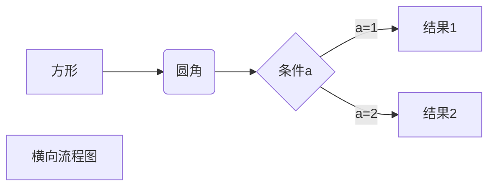

---
# the default layout is 'page'
icon: fas fa-info-circle
order: 4
---

> 编写规范参照：**[Markdown](https://markdown.com.cn/basic-syntax/ "MK")** 
**\|**
>**[Jekyll中文网](http://jekyllcn.com/ "Jekyll")**
**\|**
>**[icon](https://fontawesome.com/search?q=wechat&o=r "icon")**
**\|**
>**[图床](https://sm.ms/ "SM.SM")**
**\|**
>**[favicon](https://realfavicongenerator.net/ "favicon")**
{: .prompt-tip }

- HELP

#### 头信息(Front Matter) *
``` yaml
title: 
date: 2023-05-22 17:00:00 +0800
categories: [web, jekyll] 
tags: [web, jekyll]
comments: false
description: . # 描述
author: # 作者信息
  name: Full Name
  link: https://example.com
toc: false # 关闭目录
math: true # 加载数学功能
mermaid: true # 启用Mermaid
pin: true # 置顶帖子

```
#### 字体 *
```
**粗体**
*斜体*
~~删除线~~
<u>下划线</u>
```
#### 列表 *
```yaml
# 有序列表
1. list1
2. list2
# 无序列表
- one
- two
# 任务列表
- [ ] task 1
- [x] task 2
# 描述列表\* Chirpy适用：
Sun
: the star around which the earth orbits
Moon
: the natural satellite of the earth, visible by reflected light from the sun
```
- 有序列表：数字 + 空格，无序列表：- + 空格。tab键缩进实现n级列表，shift+tab反之

- [ ] task
- [x] task

Sun
: the star around which the earth orbits

#### 链接 

```
纯URL：<https://jinhanlei.github.io/>
文字上加超链接: [jinhanlei](https://jinhanlei.github.io/)
使用链接变量（如果同一个链接使用很多遍，可以使用一个变量来定义该链接，犹如论文）：
[jinhanlei][1]
[1]:https://jinhanlei.github.io/（这句话是看不见的）
```

#### 图片 *
```

在light模式下呈现阴影效果：
{: .shadow}
```

#### 代码 *
```
# 代码块
```python
print("hello world")
# 内联代码，一般写在正文中
`hello，world!`
```

#### 表格 *
``` mrakdown
| Column1 | Column2 |
| ------- | ------- |
| Row1    | test    |
| Row2    | aaa     |
| Row3    | bb      |
| Row4    | cc      |
```

| Column1 | Column2 |
| ------- | ------- |
| Row1    | test    |
| Row2    | aaa     |
| Row3    | bb      |
| Row4    | cc      |

#### 媒体源 *
```
<iframe width="420" height="315" src="//player.bilibili.com/player.html?aid=80433022&bvid=BV1GJ411x7h7&cid=137649199&page=1" frameborder="0" allowfullscreen></iframe>
```

#### 提示 *
```
> Example line for prompt.
{: .prompt-info }
(可选prompt-tip、prompt-info、prompt-warning、prompt-danger)
```
#### 脚注 *
```
"never gonna give you up"——Rick[^Rick]
[^Rick]: Rick是一位著名歌手。
```

"never gonna give you up"——Rick[^Rick]

[^Rick]: Rick是一位著名歌手。

#### 数学 *
```
# 内联公式
$x+y$
# 公式块
$$
\begin{Bmatrix}
   a & b \\
   c & d
\end{Bmatrix}
$$

$$
\begin{CD}
   A @>a>> B \\
@VbVV @AAcA \\
   C @= D
\end{CD}
$$
```
- 确保在头信息中开启math: true，支持 KaTeX 或者 MathJax 来渲染数学表达式。

#### 横道图 *


#### 其他 *
由于markdown支持HTML，因此HTML也可以在网页中直接呈现，比如：
```
这是 <kbd>Ctrl</kbd> 建
```
这是 <kbd>Ctrl</kbd> 键 [^ctrl]

[^ctrl]: 遇到无法正常显示的文本，需要转义，前面加反斜杠\。切记！不可以直接使用<>，必需加上反斜杠，不然push到GitHub会报错！